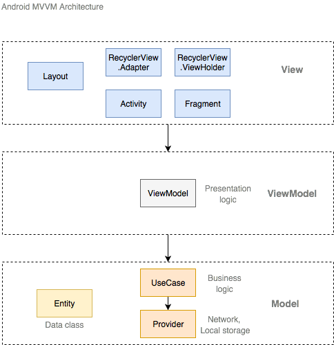
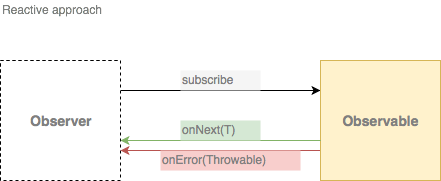

# Android MVVM Demo

## Introduction
This tutorial is about how to architect your android application to make sure that it will be

- Easy to maintain (separation of concerns)
- Easy to test (dependency injection)
- Very concise
- Decoupled

## ModelView View Model
There are several Design pattern that could be used for android apps. See [Common design patters for Android with Kotlin](https://www.raywenderlich.com/168038/common-design-patterns-android-kotlin)

Anyway Google recommends the MVVM pattern in his [Guide to App Architecture](https://developer.android.com/jetpack/docs/guide)

The major benefits of this pattern are:

- separation of concerns
- Google recently introduced this pattern as part of its [Architecture Components library](https://developer.android.com/topic/libraries/architecture/viewmodel)
- completely decoupled compared to MVP
- take advantage of data binding, more event-drivent than MVP. 

## How it looks like

### View
User interface: Layout, Activity, Fragment, Navigator, RecyclerView.Adapter, RecyclerView.ViewHolder
- Inflate layout
- Listen user inputs and inform viewModel about user actions
- Show dialog, toast
- Perform animations
- Start activity
- All functionality related to Android Context

### ViewModel
Presentation logic: ViewModel classes
- Expose view friendly stream of data
- Expose view state ( loading, error, other states)
- Validate user input
- Execute calls to model
- Raise events (navigation, toast)

### Model
Data class and Business logic: Data class, DataManager, Providers
- Call to API
- Call to loca storage (DataBase, SharedPreferences, File)
- Call to device capabilities

## Reactive approach
Make more concise code RX extensions.
Avoid interface boilderplates.

## Unit Testing
An Unit test is a small piece of code that test the behaviour or other code. It prove that it works! A good unit test is independent and focus on a single logical concept. 

### Test main actions

- Arrange objects (setup mocks)
- Execute (act on the tested object)
- Verify (assert that something is as expected)

### Dependency injection

DI is a Software pattern that implements passing a service to a client rather than allowing a client to build the service. It allows to test app.

Read more [Koin](https://insert-koin.io/docs/1.0/reference/android/)

### Mock

Mock is a fake object that replaces the dependency of tested class.

Read more [Mockito](https://github.com/mockito/mockito/wiki/Mockito-for-Kotlin)
